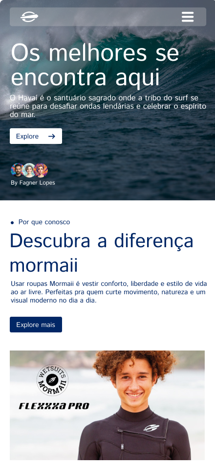

# 🌊 Mormaii Mobile UI – Surf Lifestyle

Projeto de **tela mobile (UI/UX)** inspirado no lifestyle surf da **Mormaii**, trazendo um visual moderno, clean e conectado com o mar, esporte e liberdade.

---

## 📱 Preview do Layout

<!-- IMAGEM DO PROJETO -->

  

> 💡 Substitua `preview.png` pelo nome da imagem exportada do Figma.

---

## 🎨 Conceito do Design

O layout foi pensado para transmitir:
- 🌊 Conexão com o mar  
- 🏄 Espírito do surf  
- 👕 Estilo de vida Mormaii  
- 📱 Experiência mobile fluida e moderna  

Cores, tipografia e espaçamentos seguem uma proposta leve, esportiva e atual.

---

## 🛠️ Ferramentas Utilizadas

- **Figma** (UI/UX Design)
- Conceitos de **Mobile First**
- Referência visual da marca **Mormaii**

---

## 📐 Estrutura da Tela

- Header com identidade visual
- Área de destaque (hero)
- Conteúdo organizado para mobile
- Design focado em usabilidade e estética

---

## 🎯 Objetivo do Projeto

- Praticar **UI/UX Design**
- Criar um layout mobile inspirado em uma marca real
- Desenvolver senso visual para produtos digitais
- Montar portfólio

---

## 👤 Autor

Desenvolvido por **Fagner Lopes Paiva**  
💻 Estudante de Front-end & UI/UX  
🌐 GitHub: [@Fagner-Lopes-Paiva](https://github.com/Fagner-Lopes-Paiva)

---

## 📌 Observações

Este projeto é **conceitual**, sem fins comerciais, criado apenas para estudos e prática de design.

---

🏄‍♂️ *Surf. Estilo. Liberdade. Mormaii.*
